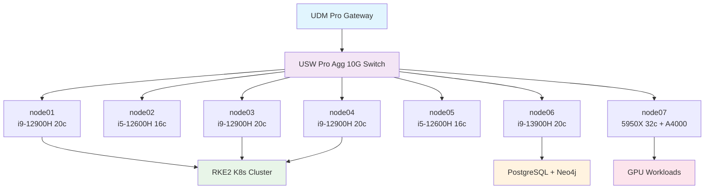

<!--
---
title: "radioastronomyio Organization"
description: "Astronomical research computing platform designed as a skill multiplier laboratory"
author: "VintageDon"
date: "2025-12-22"
status: "Published"
---
-->

# RadioAstronomy.io

**Astronomical research computing platform designed as a skill multiplier laboratory**

---

## 🔭 Mission

This organization develops enterprise-grade astronomical research computing infrastructure that creates cascading skill development across systems engineering, DevOps, security, automation, machine learning, and AI. Every infrastructure decision drives research capability, which informs better automation, which teaches deeper technical skills.

Our work focuses on computational analysis of high-quality public astronomical datasets, positioning for upcoming surveys like Vera Rubin Observatory while building reproducible workflows that demonstrate how modern enterprise practices enable rather than hinder scientific research.

---

## 📦 Repositories

| Repository | Domain | Description | Status |
|------------|--------|-------------|--------|
| [proxmox-astronomy-lab](https://github.com/radioastronomyio/proxmox-astronomy-lab) | Infrastructure | Platform documentation, VM inventory, network architecture | Production |
| [desi-cosmic-void-galaxies](https://github.com/radioastronomyio/desi-cosmic-void-galaxies) | Research | Galaxy populations in cosmic voids using DESI DR1 | Active |
| [desi-quasar-outflows](https://github.com/radioastronomyio/desi-quasar-outflows) | Research | AGN outflow spectral fitting and Cloudy modeling | Active |
| [desi-qso-anomaly-detection](https://github.com/radioastronomyio/desi-qso-anomaly-detection) | Research | ML anomaly detection for quasar spectra | Active |
| [rbh1-validation-reanalysis](https://github.com/radioastronomyio/rbh1-validation-reanalysis) | Research | Independent reanalysis of RBH-1 hypervelocity SMBH candidate | Active |
| [year-of-code-2026](https://github.com/radioastronomyio/year-of-code-2026) | Development | 2026 project sandbox: AI, ML, agentic coding, cloud infrastructure | Active |

---

## 🏗️ Platform Architecture

Production research platform running on a 7-node Proxmox cluster built from mini-PC form factor workstations.

### Cluster Specifications

| Resource | Value |
|----------|-------|
| Nodes | 7 |
| Total Cores | 144 |
| Total RAM | 704 GB |
| Total NVMe | 26 TB |
| Network Fabric | 10G LACP per node |
| GPU | RTX A4000 16GB |

### Node Inventory

| Node | CPU | Cores | RAM | Role |
|------|-----|-------|-----|------|
| node01 | i9-12900H | 20 | 96 GB | Compute (K8s) |
| node02 | i5-12600H | 16 | 96 GB | Light compute + 6T storage |
| node03 | i9-12900H | 20 | 96 GB | Compute (K8s) |
| node04 | i9-12900H | 20 | 96 GB | Compute (K8s) |
| node05 | i5-12600H | 16 | 96 GB | Light compute + 6T storage |
| node06 | i9-13900H | 20 | 96 GB | Heavy compute (databases) |
| node07 | AMD 5950X | 32 | 128 GB | GPU compute |

### Architecture Diagram

### Platform Capabilities

- **Hybrid Kubernetes + VM Architecture**: RKE2 orchestration with strategic static VMs for databases and persistent services
- **Enterprise Security Baseline**: CIS Controls implementation with research workflow accommodations
- **Secure Remote Access**: Entra ID hybrid identity with Cloudflare ZTNA
- **Open Source Toolchain**: GitOps automation, container orchestration, scientific computing workflows

---

## 🔬 Active Research

### DESI Cosmic Void Analysis

Analyzing large-scale structure using DESI Data Release 1, examining galaxy populations within cosmic voids. Processing 30GB+ PostgreSQL datasets, implementing statistical analysis pipelines, and developing 3D void mapping visualizations.

### DESI Quasar Outflows

Investigating AGN-driven outflows through semi-automated spectral fitting combined with Cloudy photoionization modeling. Developing automated pipelines to identify and characterize outflows in massive spectroscopic datasets.

### DESI Anomalous Quasar Detection

ML-based anomaly detection across millions of quasar spectra. Implementing 1D convolutional variational autoencoders on Ray clusters to identify statistically unusual objects that may represent new physics or rare phenomena.

### RBH-1 Validation Reanalysis

Independent validation and reanalysis of the RBH-1 hypervelocity SMBH candidate (van Dokkum et al. 2025) using Bayesian inference and GPU-accelerated computing.

---

## 🧪 Technology Stack

### Languages & Frameworks

### Databases

### AI/ML

### Infrastructure

### Observability

---

## 🤝 OSS Program Support

This organization benefits from open source programs that provide tooling to qualifying public repositories.

### Active Programs

| Program | Provides | Use Case |
|---------|----------|----------|
| [CodeRabbit](https://coderabbit.ai) | AI code review (Pro tier) | PR review, CLI integration with agentic coding tools |
| [Atlassian](https://www.atlassian.com/software/views/open-source-license-request) | Jira, Confluence (Standard) | Project tracking, documentation |

### Available for Future Use

| Program | Provides | Planned Use |
|---------|----------|-------------|
| [Snyk](https://snyk.io/plans/) | Security scanning | Dependency vulnerability detection |
| [SonarCloud](https://www.sonarsource.com/open-source-editions/) | Code quality | Static analysis |
| [Sentry](https://sentry.io/for/open-source/) | Error tracking | Runtime monitoring |
| [Datadog](https://www.datadoghq.com/partner/open-source/) | Observability | Metrics, logs, APM |

---

## 🌟 Open Science Philosophy

We practice radical transparency in both research and infrastructure development:

- **Research methodologies** are fully documented and repeatable
- **Infrastructure configurations** are version-controlled and automated
- **Security implementations** demonstrate enterprise practices in research environments
- **Learning processes** are captured and shared for community benefit

All projects operate under open source licenses (primarily MIT) to ensure maximum reproducibility.

---

## 📚 Documentation

- **Documentation Hub**: [docs.radioastronomy.io](https://docs.radioastronomy.io)
- **GitHub Discussions**: Technical discussions and collaboration
- **Issue Tracking**: Project-specific development milestones

---

## 📄 License

Projects in this organization are licensed under MIT unless otherwise specified.

---

*Building astronomical research capability through enterprise infrastructure and skill multiplication*
